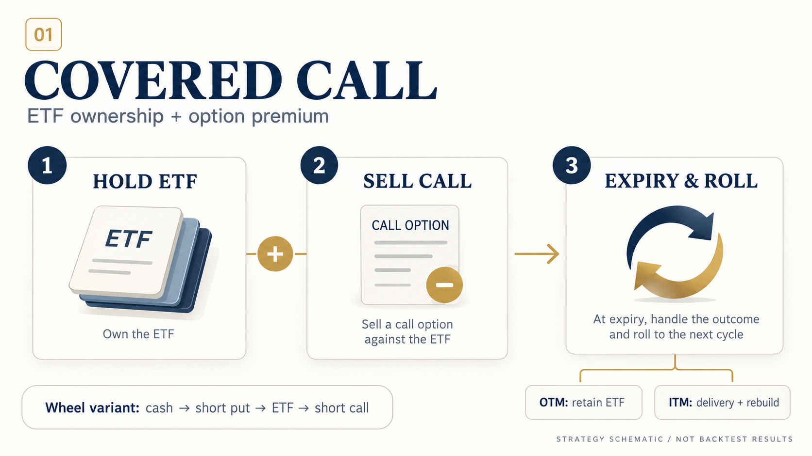

# CSI 500 ETF Covered Call Strategy

**ETF ownership · Short calls · Expiry settlement and rollover**



A custom daily backtesting framework with bundled ETF and option-chain CSVs. The local command-line entry point reuses the
original covered-call and wheel strategies, engine, and portfolio bookkeeping.

| Strategy | Position structure | Main behavior |
| :--- | :--- | :--- |
| Covered Call | Long ETF + short call | Select a call by strike level; handle exercise, rebuild ETF exposure, and roll to the next expiry |
| Wheel | Short puts while in cash; short calls while holding ETF | Switch between the original cash and ETF-holding phases |

## Quick start

From the extracted project root, with Python 3.10 or later:

```bash
python -m pip install -r requirements.txt
python -m local.run --strategy cover_call --level 1 --output runs/cover_call
python -m local.run --strategy wheel --level 1 --output runs/wheel
```

The market-data CSVs are included. Defaults follow the original notebook: October 1, 2022 to April 1, 2026,
initial cash of 1,000,000, one option contract, and 10,000 ETF shares. The ETF commission rate is `0.0001`,
option commission is `0.8` per contract, and relative option slippage is `0.001`.

The strategy does not invest all initial cash in ETF shares. Check cash balances and actual exposure when interpreting the benchmark.

## Original research

- [Covered-call notebook](中证500备兑策略/CoverCallStrategy.ipynb)
- [Wheel notebook](中证500备兑策略/OptionWheelStrategy.ipynb)
- [English research report](Cover_Call_Research_EN.pdf)
- Original implementation: `中证500备兑策略/{strategy,engine,portfolio,option_builder,data}/`

New summaries are computed from actual runs. Historical figures in the archived original README are not presented as independently verified results.

## Explore and reproduce

| File | Purpose |
| :--- | :--- |
| [Quickstart.ipynb](Quickstart.ipynb) | Guided entry point; original research notebooks remain available |
| [PROJECT_OVERVIEW.html](PROJECT_OVERVIEW.html) | Offline project overview, opened directly in a browser |
| [docs/REPRODUCE.md](docs/REPRODUCE.md) | Environment setup, data schema, commands, and outputs |
| [docs/IMPLEMENTATION_NOTES.md](docs/IMPLEMENTATION_NOTES.md) | Actual code behavior, documentation discrepancies, and boundaries |
| [docs/VALIDATION.md](docs/VALIDATION.md) | Completed checks and unverified items |
| [docs/ORIGINAL_README.md](docs/ORIGINAL_README.md) | Archived original README, including previously reported results |
| [CHANGELOG.md](CHANGELOG.md) | Scope of changes |

Each run writes daily equity, trades, parameter and data fingerprints, a log, and a table-only HTML report to `runs/`.
Nonempty output directories are never overwritten. Choose a new `--output` for each run.

## Preserve the strategy

The strategy calculations, parameters, data fields, and identifiers are preserved. Comments, docstrings, and reader-facing logs are translated. Exact original sources are retained in `archive/originals/`.
New entry points live in `local/`: no parameter optimization, additional trading rules, or changes to exercise or rollover logic.
Original notebook calculations and execution counts are retained. Comments, descriptive strings, and displayed output labels are translated; programmatic fields remain intact. English navigation is added at the top.
English research documents and market-data files are retained as source materials.

`docs/original_manifest.json` records original file hashes and retained locations. Run
`python -m local.verify_originals` to verify original archive bytes, unchanged data, and translated executable semantics.

The teaser is a user-approved strategy schematic, not a backtest result. Synthetic fixtures are selected only with an explicit `--demo`.
Previously reported results, synthetic demonstrations, and user-data runs are labeled separately.
